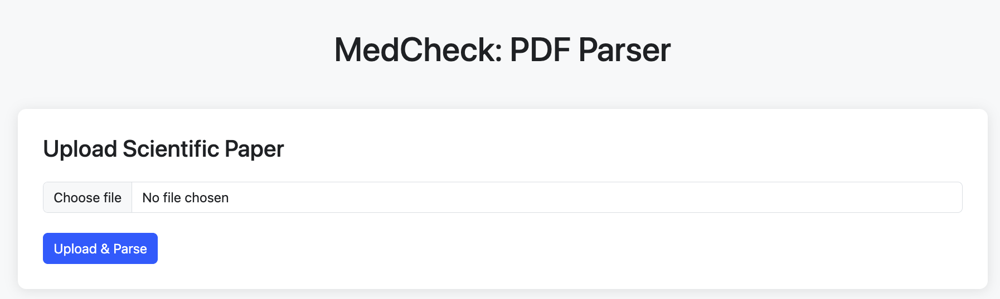
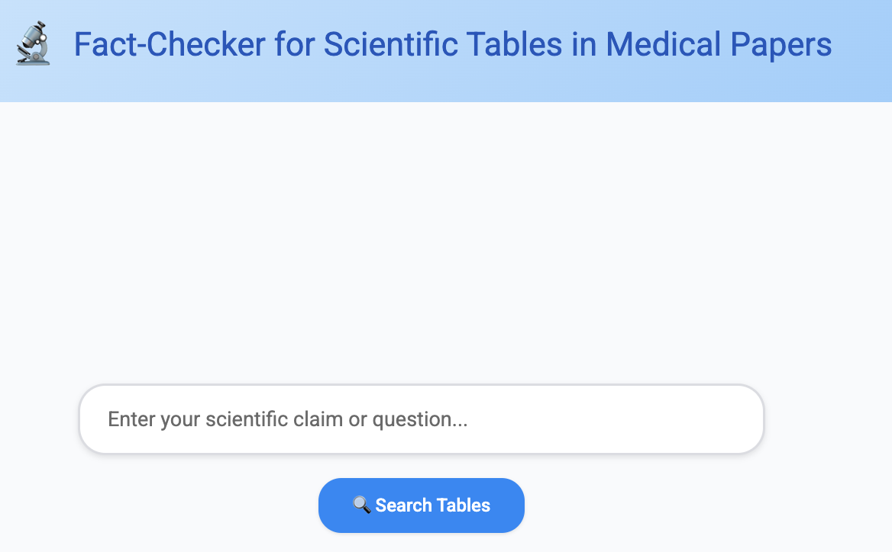
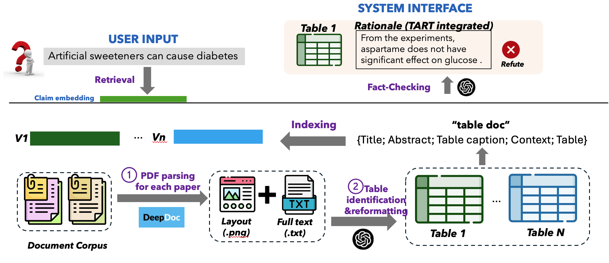

# MedCheck: A Demonstration System for Medical Paper Fact-Checking

**MedCheck** is an end-to-end system for fact-checking scientific claims using medical research papers, with a special focus on extracting and reasoning over scientific tables. The system consists of two main components:

1. **PDF Parser (`pdf_parser/`)**: Parses medical research papers (PDFs), extracts and saves scientific tables and content as structured data and page images.
2. **Retriever & Fact-Checker (`rag/`)**: Provides an interactive interface to input a scientific claim, retrieves relevant evidence (especially tables) from the parsed database, and returns fact-checking labels and rationales.

---

## Table of Contents

- [Environments and Packages](#environments-and-packages)
- [System UI Screenshots](#system-ui-screenshots)
- [System Architecture](#system-architecture)
- [Project Structure](#project-structure)
- [Component 1: PDF Parser](#component-1-pdf-parser)
- [Component 2: RAG Retriever & Fact-Checker](#component-2-rag-retriever--fact-checker)
- [How to Use](#how-to-use)
- [Unique Features](#unique-features)
- [Contact](#contact)

---

## Environments and Packages

This project is built in Python and uses typical packages for web apps, PDF parsing, and retrieval.  
**Please set up a virtual environment and install dependencies:**

```bash
python3 -m venv venv
source venv/bin/activate
pip install flask flask-cors
pip install pillow
pip install deepdoc
pip install pandas openpyxl
pip install numpy
pip install sentence-transformers
pip install faiss-cpu
pip install PyMuPDF
pip install tqdm
```

---

## System UI Screenshots
1. PDF Parsing & Upload Interface

2. Claim Retrieval & Table Fact-Checking UI



---

## System Architecture


Given a scientific claim (e.g., “Artificial sweeteners can cause diabetes”), **MedCheck** will:

1. **Parse PDF papers** to extract tables, figures, and text content.
2. **Store parsed tables** and page images for later retrieval.
3. **Retrieve relevant evidence** (especially scientific tables) from a database when a user submits a claim.
4. **Fact-check** the claim against retrieved evidence and output a concise rationale and label (e.g., Supported / Refuted / Unverified).

The system is optimized for **table-centric fact-checking**, directly addressing a key need in biomedical research.

---

## Project Structure
```bash
MedCheck/
├── pdf_parser/
│ ├── app.py # PDF upload & parsing backend (DeepDoc integration)
│ ├── templates/
│ │ └── index.html # Web UI for uploading PDFs
│ └── uploads/ # Stores parsed page images (.png) and JSON data
├── rag/
│ ├── app.py # RAG backend: retrieval and fact-checking logic
│ ├── templates/
│ │ └── index.html # Web UI for claim input and evidence display
│ └── database/ # Parsed tables/content database for retrieval
```

---

## Component 1: PDF Parser (`pdf_parser/`)

- **Purpose**: Upload a medical PDF, parse its pages, extract all tables and content, and store:
  - Page images (`.png`)
  - Table and content JSON files

- **Workflow**:
  1. User uploads a PDF via the web UI.
  2. The backend uses DeepDoc and OCR to extract both layout and content.
  3. Results (page images and parsed JSON) are saved to the `uploads/` folder.

- **UI**:  
  Access via a simple web interface (`templates/index.html`) for uploading and monitoring parse progress.

---

## Component 2: RAG Retriever & Fact-Checker (`rag/`)

- **Purpose**:  
  Input a claim, retrieve relevant scientific tables and text from the parsed database, and return fact-checking results.

- **Workflow**:
  1. User enters a scientific claim or question in the web UI.
  2. System retrieves the most relevant evidence (especially tables) from the indexed database.
  3. Outputs:
     - Table snippets, metadata, and page context
     - Fact-checking label (Supported, Refuted, etc.)
     - Concise rationale for each label

- **UI**:  
  Intuitive claim search and evidence display with table cards and on-demand fact-checking.

---

## How to Use

### 1. PDF Parsing

- Start the PDF parser service (`pdf_parser/app.py`).
- Access the web interface and upload your PDF paper(s).
- Wait for processing to complete. Parsed results will appear in the `uploads/` directory.

### 2. Claim Retrieval and Fact-Checking

- Start the RAG service (`rag/app.py`).
- Access the RAG web interface.
- Enter a scientific claim and click **Search** or **Extract Evidence**.
- View the most relevant tables, supporting text, and fact-checking labels/rationales.

**Note:** Make sure the `rag/database/` is properly populated with output from the parser.

---

## Unique Features

- **Table-Centric Reasoning**: Retrieval and fact-checking are optimized for table evidence, a key gap in existing medical QA systems.
- **Hybrid Parsing**: Combines page layout images and DeepDoc-extracted content for robust data extraction.
- **Interactive UI**: Both parser and RAG modules have user-friendly web interfaces.
- **Explainable Labels**: System provides both a decision (e.g., Supported/Refuted) and a concise rationale with step-by-step concise tool-augmented explanations.

---

## Contact

For questions or contributions, please contact `luxinyuan@u.nus.edu`.


